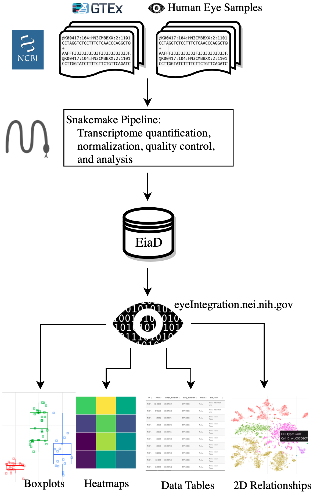
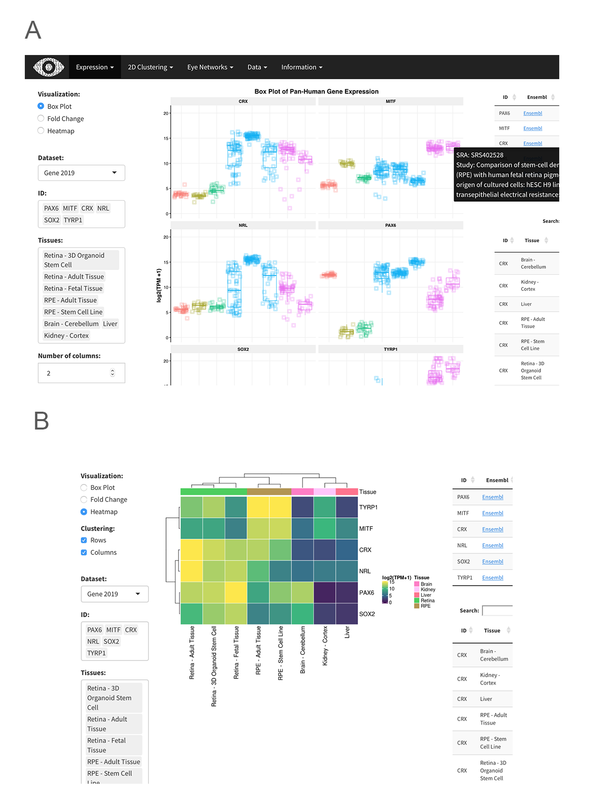
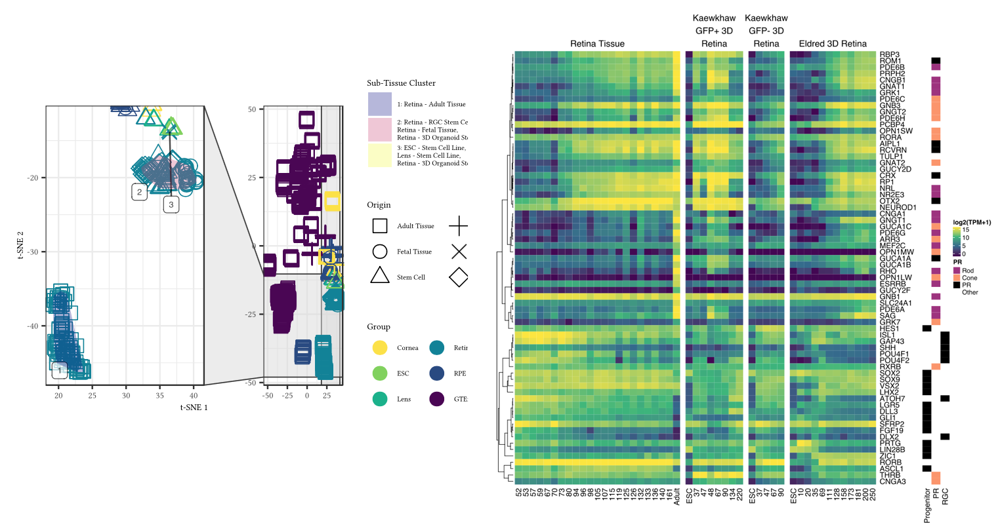
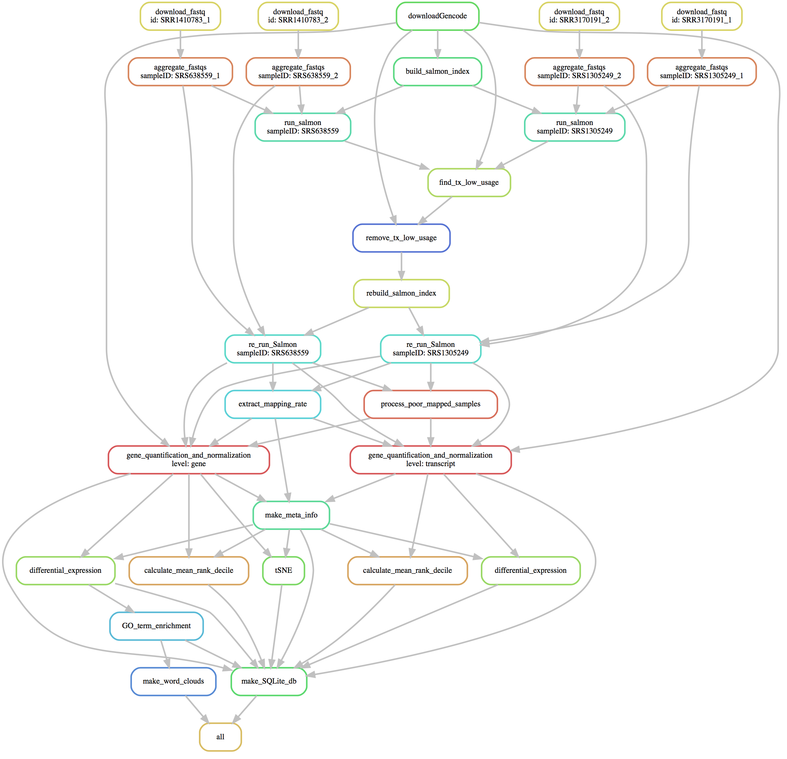
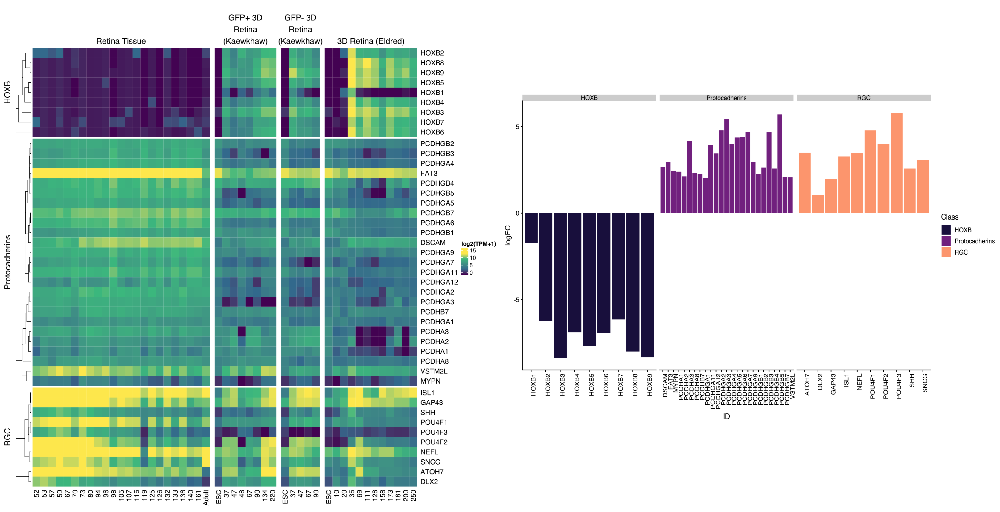

```{r Setup..., message=FALSE, warning=FALSE, include=FALSE}
#knitr::opts_chunk$set(fig.pos = 'p') # Places figures on their own pages
knitr::opts_chunk$set(out.width = '100%', dpi=300)

library(pool)
library(RSQLite)
library(tidyverse)
library(citr)
library(cowplot)
library(ggrepel)
library(colorspace)
library(flextable)
library(captioner)
library(dbscan)
library(ggforce)
library(cowplot)
library(viridis)
library(rworldmap)

# setup caption-ing
fig_cap <- captioner("Figure")
supFig_cap <- captioner("Supplemental Figure")
tab_cap <- captioner("Table")
supTab_cap <- captioner("Supplemental Table")

# attach data pools
# source('src/data_pull.R')
load('data/data_pull.Rdata')
# vinny sra search
load('data/human_tx_studies.Rdata')
# source('src/tsne_and_pca_calcs.R')
load('data/dimRed_plot_data.Rdata')
# run 'src/viewing_stats.Rmd'
load('data/visitor_stats.Rdata')
# write supplementary file for metadata
# write_csv(core_tight_2019, path = 'supplementary_materials/supplementary_files__metadata.csv')

core_tight_2019 <- core_tight_2019 %>% mutate(Origin = case_when( grepl('Transformed', Sub_Tissue, ignore.case = T) ~ 'Cell Line',
                                                                  grepl('Fetal', Sub_Tissue) ~ 'Fetal Tissue',
                                                                  grepl('Stem', Sub_Tissue) ~ 'Stem Cell',
                                                                  grepl('Organoid', Sub_Tissue) ~ 'Organoid',
                                                                  grepl('Cell Line', Sub_Tissue) ~ 'Cell Line',
                                                                  TRUE ~ 'Adult Tissue')) %>% 
  select(-run_accession) %>% 
  unique() 

# set up maps
visitorMap_cap <- supFig_cap(name='visitorMap', caption = paste('As of January 2019, eyeIntegration has had usage across', cities %>% unique() %>% length(), 'cities and', geo_locate$countries %>% unique() %>% length(), 'countries.'))

world <- map_data("world")
world <- world[world$region != "Antarctica",]

```


# Introduction

## RNA-seq is the predominant technology for deciphering transcriptomes

From anterior to posterior, the human eye is composed of the cornea, lens, retina, retinal pigment epithelium (RPE), and choroid. The differentiation, maturation, and function of these tissues is mediated through spatial and temporal specific transcript and gene expression patterns, also known as the transcriptome. Today, RNA-sequencing (RNA-seq) is the predominant technology for quantifying the transcriptome. Analysis of the transcript expression across tissue, time, and perturbation allows researchers to decipher the genetic controls of eye development and function. To this end, researchers have used a wide variety of human tissue sources to assess gene function, including primary tissue (fetal and post-mortem), differentiated stem cells, immortalized cell lines, and most recently, organoids. These tissue types have been deeply sequenced across the cornea [@chenIdentificationNovelMolecular2013a; @chngHighThroughputGene2013a; @chungTranscriptomicProfilingPosterior2017; @fraustoTranscriptomicAnalysisCultured2016a; @kabzaCollagenSynthesisDisruption2017; @ouyangWNT7APAX6Define2014a; @songDirectedDifferentiationHuman2016a], lens [@hanWnt5aContributesDifferentiation2018], retina [@aldiriDynamicEpigeneticLandscape2017a; @farkasTranscriptomeAnalysesHuman2013b; @hoshinoMolecularAnatomyDeveloping2017; @kaewkhawTranscriptomeDynamicsDeveloping2015; @kaewkhawTreatmentParadigmsRetinal2016; @liComprehensiveAnalysisGene2014b; @mustafiTranscriptomeAnalysisReveals2016; @pinelliAtlasGeneExpression2016; @whitmoreTranscriptomicAnalysisNasal2014b], and RPE (choroid) [@darrowDeletionDXZ4Human2016a; @harenzaTranscriptomicProfiling392017; @huIdentificationMiRNASignatures2012b; @liComprehensiveAnalysisGene2014b; @nozawaSAFARegulatesInterphase2017; @obersteinCellularResponsesHuman2017; @pengEngineeringBloodRetinalBarrier2013; @radekeRestorationMesenchymalRetinal2015a; @sainiNicotinamideAmelioratesDisease2017; @samuelAppropriatelyDifferentiatedARPE192017; @santaguidaAneuploidyinducedCellularStresses2015a; @shaoSpontaneousGenerationNovel2017; @shihRestorationMesenchymalRPE2017; @smithRetinalPigmentEpithelial2017; @stevensonGiantinknockoutModelsReveal2017; @tresiniCoreSpliceosomeTarget2015; @whewaySiRNAbasedFunctionalGenomics2015; @whitmoreTranscriptomicAnalysisNasal2014b; @auCharacterizationLincRNAExpression2017]. 


## The GTEx gene expression resource lacks eye-specific tissues
The Genotype-Tissue Expression (GTEx) Project has generated RNA-seq data across dozens of post-mortem human tissues from hundreds of unique donors and presents the gene and transcript level data in a efficient web app (https://gtexportal.org/) [@carithersNovelApproachHighQuality2015; @gtexconsortiumGeneticEffectsGene2017]. However, no eye tissues are included in their resource. The Sequence Read Archive (SRA) and European Nucleotide Archive (ENA) are the primary repositories for all raw sequence data and two groups have quantified large portions of the RNA-seq data, including some human eye tissues, from the SRA: recount2 and ARCHS4 [@collado-torresReproducibleRNAseqAnalysis2017; @lachmannMassiveMiningPublicly2018]. To date, no curation of the sample level metadata has been done, so it is challenging to parse out which eye tissues are present and even more difficult to determine whether any samples were chemically or genetically perturbed. More targeted web resources that allow researchers to quickly assess gene expression in eye tissues include iSYTE, EXPRESS, and retina.Tigem.it [@budakExpressDatabaseTranscriptome2018a; @kakranaISyTEDatabaseExpressionbased2018; @pinelliAtlasGeneExpression2016]. iSYTE only includes lens samples, EXPRESS is limited to a subset of mouse lens and retina samples, and retina.Tigem.it is retina only. 

**ADD MENTION OF NEW SWAROOP DATA "GREx"**

## eyeIntegration app interactivey serves huge GTEx and human eye tissue datasets (EiaD)
The eyeIntegration web resource (https://eyeIntegration.nei.nih), originally released in 2017, provides the largest set of transcriptomes from hand-curated human eye tissues along with hundreds of GTEx tissue samples [@Bryan_2018]. This interactive web app allows for quick transcript and gene comparisons across many eye tissues and dozens of other body tissues. The dataset that the original eyeIntegration web app served was created with a series of scripts, several of which were run interactively to hand-assess quality control for the samples. The interactive nature of some of the steps precludes efficient and regular data updates for the data.

To better meet the needs of the eye research community we have re-written the bioinformatic pipeline that creates the eye and body RNA-seq dataset to allow for regular, versioned updates for eyeIntegration. We call this reproducible and versioned transcriptome dataset "Eye in a Disk" (EiaD). The pipeline automates the EiaD creation, ensures full reproducibility of the results, allow for external data comparison, provide consistent sample quality control, and improves efficiency for future sample updates. The 2019 EiaD dataset contains several new tissue types, full gene product quantification, along with over 100 new samples and improved sample labeling. The eyeIntegration web app has also been re-written to provide many new features, including versioned EiaD datasets, custom URL shortcut creation, new visualizations, improved data tables searching, easy download of core datasets, and local install of the entire app with three commands. Additionally, we are prototyping new tools to display single cell RNA-seq (scRNA-seq) data to provide researchers access to cell type specific information about gene expression across murine retinal development.

## EiaD dataset and eyeIntegration used to identify potential avenues to improve retina organoid maturation

Retina organoids 

# Methods
## Identification of potential eye samples 
We exhaustively searched the SRA with the SRAdb R package for eye related tissues using the query ‘cornea|retina|RPE|macula|fovea|choroid|sclera|iris|lens|eye’ across all columns and rows in the 'sra' table [@leinonenSequenceReadArchive2011; @zhuSRAdbQueryUse2013a]. We hand selected relevant studies and selected healthy, control or unmodified samples spanning primary adult tissue, primary fetal tissue, induced pluripotent stem cell (iPSC)-derived tissue, stem cell derived organoids, and immortalized cell lines. In order to compare gene expression in the eye against expression in other body tissues, we obtained samples from `r core_tight_2019 %>% filter(study_accession == 'SRP012682') %>% pull(Sub_Tissue) %>% unique() %>% length()` different body tissues that contained at least 10 male and 10 female samples from the GTEx project. Using SRA metadata from each study we extracted sample and run accessions, library type, tissue of origin, and sub-tissue of origin. Any of the preceding information missing from the SRA metadata was added by hand, when available. Stem cell-derived tissues and cell lines are marked as sub-tissues of the tissue they model.

## Raw data download and quantification
We downloaded the relevant SRA files for each sample directly from the NCBI ftp server using the file transfer software Aspera. SRA files were converted to FASTQ format using the tool fastq-dump from the SRAtoolkit software package [@leinonenSequenceReadArchive2011]. Samples only available in the BAM format were converted to FASTQ format using SAMTools [@liSequenceAlignmentMap2009]. Sample transcriptomes were quantified using the alignment free quantification software Salmon, using transcriptomic index built from gencode v28 protein coding transcript sequences using the transcriptomic aligner Salmon [@harrowGENCODEReferenceHuman2012; @patroSalmonProvidesFast2017a]. Using the resulting expression quantification, we identified lowly or unused transcripts within the gencode annotation, and removed transcripts that accounted for 5% or less of the total expression for its parent gene as per Sonneson et al [@sonesonIsoformPrefilteringImproves2016]. Samples were re-quantified against a transcriptomic index built on the filtered transcript sequences. The Salmon count values were quantified as (transcript) length scaled Transcripts Per Million (TPM) to the transcript and gene level using tximport [@sonesonDifferentialAnalysesRNAseq2016a].  

## Quality control 
We first removed  samples with a Salmon calculated mapping rate less than 40%. We further filtered samples by calculating the median gene expression for each sample and only kept samples that had a median count >2 across all genes. We removed lowly expressed genes by calculating the median expression across all samples for each gene and kept genes that had a median count >200 across all samples. To reduce the noise from experimental variability between each study, we normalized samples by sequence library size using the calcNormFactors function from the edgeR r-package, and then quantile smoothed expression data using the R package qsmooth at the tissue level [@hicksSmoothQuantileNormalization2018a; @robinsonEdgeRBioconductorPackage2010].  

We generated sample level two-dimensional groupings by with the t-Stochastic Neighbor Embedding (t-SNE) algorithm [@maatenAcceleratingTSNEUsing2014]. We then calculated the center of the resulting sub-tissue clusters by finding the average two-dimensional coordinates of all samples of a given sub-tissue type (p1). We used these sub-tissues groupings to identify outlier samples, or samples that failed to cluster with other samples of the same sub-tissue type, by measuring the euclidean distance of each sample (p2) from its sub-tissue cluster center and removed samples that had distance 4 standard deviations from the average distance with the equation $dist = \sqrt\sum(p1-p2)^{2}$.  

## Differential Gene Expression Analysis and GO term enrichment
We used the processed data to determine differential gene expression between different sub-tissue types. First, we generated a synthetic body set to serve as single representative sub-tissue type for pan-body gene expression by randomly sampling GTEx tissues.  We used the voom function from the limma R package to convert gene expression to precision weights, and then performed pairwise differential expression tests for all combinations of eye sub-tissues, the synthetic body tissue, and human body tissues using an empirical Bayes test [@ritchielimmaPowersDifferential2015; @lawVoomPrecisionWeights2014]. We extracted significant genes (FDR p < 0.01) for all `r limma_DE_tests %>% nrow()` comparisons and used these to calculate GO enrichment. The significant gene list for each eye sub-tissue was split into upregulated and down regulated sets and each set was tested for enrichment using the enrichGO function from the clusterProfiler R package (q-value < 0.01) [@yuClusterProfilerPackageComparing2012].

## eyeIntegration web app and R package
The data generated in the above steps is consolidated into a SQLite database, with the original dataset for eyeIntegration and the new 2019 EiaD dataset each getting a separate database file. The code that creates the eyeIntegration web app is written in Shiny and R and has been wrapped into an R package (https://github.com/davemcg/eyeIntegration_app/) that can be deployed on a local computer or a web server (https://eyeIntegration.nei.nih.gov). The app can be deployed on a local computer with 35GB of free disk space by running three commands in R: "devtools::install_github('davemcg/eyeIntegration_app')", "eyeIntegrationApp::get_eyeIntegration_datasets()", and  "eyeIntegrationApp::run_eyeIntegration()". 

## Snakemake reproducible pipeline
While the sample search and metadata parsing in a semi-curated process, the processing from the raw data to the creation of the SQLite EiaD database underlying eyeIntegration is wrapped in a Snakemake pipeline, which ensures full reproducibility of the results [@kosterSnakemakeScalableBioinformatics2012]. We make the code for the pipeline available at https://github.com/davemcg/EiaD_build. 

## scRNA-seq processing
The eyeIntegration site, as of January 2019, hosts two large scRNA-seq datasets from Macosko et al. and Clark et al [@macoskoHighlyParallelGenomewide2015a; @clarkComprehensiveAnalysisRetinal2018]. We use the processed gene count data from each group, as well as their cluster assignments which specify what cell type each individual cell is. The count data is mean averaged to the cell type, age, and gene level for the single cell expression section of eyeIntegration. We also display t-SNE and UMAP-based two-dimensional visualizations of the Macosko and Clark data, respectively, in the web app. For detail so the t-SNE processing we did on the Macosko dataset, see the methods of Bryan et al [@Bryan_2018]. 

## Manuscript as code
This manuscript's figures (excepting (Figure 2)), tables, and most numbers, are all created and laid out in a R markdown document that interweaves code and text. The knitr and pandoc program is used to lay out the figures and tables and output a docx file. The code that generates this manuscript can be found at https://github.com/davemcg/eyeIntegration_v1_app_manuscript. 

# Results

## EiaD 2019 contains `r core_tight_2019 %>% filter(Kept == 'Kept') %>% filter(study_accession == 'SRP012682') %>% pull(Sub_Tissue) %>% table() %>% length()` GTEx body sub-tissue types along with `r ((core_tight_2019 %>% filter(Kept == 'Kept') %>% pull(study_accession) %>% unique()) %in% (core_tight_2017$study_accession %>% unique())) %>% table() %>% as_tibble() %>% slice(1) %>% pull(n)` new human eye RNA-seq studies, `r ((core_tight_2019 %>% filter(Kept=='Kept', study_accession != 'SRP012682') %>% pull(sample_accession)) %>% length()) - core_tight_2017 %>% filter(study_accession != 'SRP012682') %>% nrow()` new samples, `r ((core_tight_2019 %>% filter(Kept=='Kept', study_accession != 'SRP012682') %>% pull(Sub_Tissue)) %>% unique() %>% length()) - 1` eye sub-tissue types

```{r tissueCountsBarPlot, fig.height = 4, fig.cap=tissueCountsBarPlot_cap, echo=F}
tissueCountsBarPlot_cap <- fig_cap(name='tissueCountsBarPlot', caption = 'Substantial increase in eye tissue count and type from 2017 to 2019 EiaD. We also improved the metadata labelling, the cornea samples now delineats endothelial and epithelial tissues and the retina samples distinguish retina organoid and retinal ganglion cell (RGC) from stem cells.')

core_both <- bind_rows(core_tight_2019 %>% mutate(Version = '2019 EiaD') %>% filter(Kept == 'Kept'), core_tight_2017 %>% mutate(Version = '2017') %>% mutate(Sub_Tissue = gsub('_',' - ', Sub_Tissue))) %>% unique()

core_both %>% filter(grepl('Retina|Cornea|Lens|RPE', Tissue)) %>% unique() %>% 
  #mutate(Sub_Tissue = case_when(sample_accession == 'SRS1955479' ~ 'Retina - Adult Tissue', TRUE ~ Sub_Tissue)) %>%
  group_by(Tissue, Sub_Tissue, Version) %>% summarise(Count=n()) %>% 
  mutate(Dataset = Version) %>% 
  ggplot(aes(x=Sub_Tissue, y=Count, fill=Tissue, alpha = Dataset)) + geom_bar(stat = 'identity', position = 'dodge') + theme_minimal() + theme(axis.text.x=element_text(angle=90, hjust=1, vjust=0.3)) + scale_colour_manual(values = c('grey','black')) + xlab('') +
  ylab('Count of Samples') + scale_alpha_manual(values = c(0.5,1)) +
  theme(text = element_text(size = 10)) +
  scale_fill_discrete_sequential(palette = 'viridis')  
```


Our initial query to the SRA found `r human_tx_studies$study_accession %>% unique() %>% length()` potentially relevant studies deposited since our last search on January 19, 2017. We removed non-pertinent studies and selected healthy or unmodified tissue from each relevant study for a total, including  of `r core_tight_2019$study_accession %>% unique() %>% length()` studies, `r ((core_tight_2019$study_accession %>% unique()) %in% (core_tight_2017$study_accession %>% unique())) %>% table() %>% as_tibble() %>% slice(1) %>% pull(n)` of which are new to the 2019 EiaD dataset. The 2019 EiaD dataset contains `r core_tight_2019 %>% filter(Kept == 'Kept') %>% filter(study_accession != 'SRP012682') %>% nrow()` human eye tissue samples and also includes `r core_tight_2019 %>% filter(Kept == 'Kept') %>% filter(study_accession == 'SRP012682') %>% nrow()` GTEx samples across `r core_tight_2019 %>% filter(Kept == 'Kept') %>% filter(study_accession == 'SRP012682') %>% pull(Sub_Tissue) %>% table() %>% length()` tissues for easy comparison (`r tab_cap(name = 'tableSampleCounts', display = 'cite')`, `r supTab_cap(name = 'tableSampleCountsGTEx', display = 'cite')`). The 2019 EiaD contains `r core_tight_2019 %>% filter(Kept == 'Kept', Tissue == 'ESC') %>% nrow()` undifferentiated iPSC, `r core_tight_2019 %>% filter(Kept == 'Kept', Tissue == 'Cornea') %>% nrow()` cornea, `r core_tight_2019 %>% filter(Kept == 'Kept', Tissue == 'Lens') %>% nrow()` lens, `r core_tight_2019 %>% filter(Kept == 'Kept', Tissue == 'Retina') %>% nrow()` retina, and `r core_tight_2019 %>% filter(Kept == 'Kept', Tissue == 'RPE') %>% nrow()` RPE (choroid) samples; in total we have added `r ((core_tight_2019 %>% filter(Kept=='Kept', study_accession != 'SRP012682') %>% pull(sample_accession)) %>% length()) - core_tight_2017 %>% filter(study_accession != 'SRP012682') %>% nrow()` new samples to the 2019 EiaD  (`r fig_cap(name = 'tissueCountsBarPlot', display = 'cite')`). 

Stem cell-derived cornea, stem cell-derived lens, and fetal retina are three new types of sub-tissues that are now available in EiaD We have also substantially improved the granularity of the cornea tissue metadata, now delinerating whether the tissue is from the endothelium or epithelium (`r fig_cap(name = 'tissueCountsBarPlot', display = 'cite')`); previously these had been grouped together as adult tissue. Similarly we more precisely delineate our retina tissues; we drop the "stem cell" sub-tissue classification for organoid and retinal ganglion cells (RGC). Another substantial addition to the 2019 EiaD are non-protein coding genes. We now quantify expression across `r gene_anno %>% count(gene_type) %>% as_tibble() %>% nrow()` gene and  `r tx_anno%>% count(transcript_type) %>% as_tibble() %>% nrow()` transcript types, including protein coding, retained intron, lincRNA, antisense, and pseuodgenes (`r supTab_cap(name = 'tx_and_gene_types', display = 'cite')`).

## Rigorous quality control and reproducible workflow system ensures high quality transcriptomes that consistently cluster together by tissue type
```{bash, echo = F, eval = F}
# ran in biowulf2.nih.gov:/data/mcgaugheyd/projects/nei/mcgaughey/auto_eyeIntegration
# 1314 from running: for i in RE_quant_files/*/lib_format_counts.json; do echo $i; done | wc -l 
# 46030412878 from running: for i in RE_quant_files/*/lib_format_counts.json; do grep num_compatible_fragments $i; done |  cut -f2 -d":" | cut -f1 -d"," | awk '{sum += $1} END {print sum}'
```


```{r workflowDoodle, echo = F, fig.width = 10, fig.height = 10, results='asis', fig.cap = workflowDoodle_cap}
workflowDoodle_cap <- fig_cap(name='workflowDoodle', caption = paste0('Raw RNA-seq data from the SRA is run through our pipeline to create the EiaD, which is used by eyeIntegration app to serve interactive gene expression visualizations across ', core_tight_2019 %>% pull(Sub_Tissue) %>% unique() %>% length(), ' tissues'))


```

We built an automated pipeline for processing and analyzing all data for the web app using the program Snakemake, a python-based workflow management system that allows for efficient parallel execution of the analysis, facilitates reproduction by others, and simplifies long term maintenance of the EiaD data (`r fig_cap(name='workflowDoodle', display = 'cite')`, `r supFig_cap(name='snakemakeDAG', display = 'cite')`)[@kosterSnakemakeScalableBioinformatics2012]. To create a high quality final dataset across the `r core_tight_2019 %>% nrow()` initial samples (`r supTab_cap(name = 'metadataTable', display = 'cite')`)  and 46,030,412,878 reads we developed a rigorous quality control procedure as part of our analysis, considering a sample’s read mapping rate and median count level as well as behavior relative to samples of the same sub-tissue type (see Methods).  To identify tube mislabeling or sample extraction issues, we used t-SNE to group samples by sub-tissue type to identify variability within samples of the same sub-tissue and ensure overall consistency in data processing (`r fig_cap(name = 'tSNE', display = 'cite')`). 

After our quality control and processing workflow, we found that samples of the same tissue type and origin cluster well together (`r fig_cap(name = 'tSNE', display = 'cite')`). For example, in retina-derived tissue, primary adult tissue clusters tightly and distinctly from other cell types, and retinal organoids and fetal retina tissue cluster together. Our ability to uniformly cluster data by known biological function independent of study origin demonstrates that our workflow can effectively account for technical variation between studies. 

While t-SNE is a powerful algorithm for grouping samples, it is not consistent for determining the relationships between clusters [@wattenbergHowUseTSNE2016a]; PCA is more useful in this regards. We ran a PCA dimensionality reduction (`r supFig_cap(name = 'allSamplePCA', display = 'cite')`) on all samples, finding that the eye tissues still generally group together and apart from the human body tissues. Adult retina is most similar to the brain tissue, pituitary is similar to adult RPE, and skin and blood are similar to cornea. 

```{r tsne, fig.height = 15, fig.width = 20, echo = F, message = F, fig.cap=tsne_cap}
tsne_cap <- fig_cap(name='tSNE', caption = 't-SNE two-dimensional transcriptome profiles by sample demonstrate effective quality control and transcriptome processing. Colors match different tissue types and shapes of points define the origin of the tissues.')

dbscan_cluster <- dbscan(tsne_50 %>% select(X1, X2),  minPts = 3, eps = 2.5)
tsne_50$Cluster <- dbscan_cluster$cluster
col1 = 'X1'
col2 = 'X2'
# create label points for each cluster
cluster_centers <- tsne_50 %>%
  left_join(.,core_tight_2019) %>% group_by(Cluster) %>%
  summarise(C1=mean(!!sym(col1)),C2=mean(!!sym(col2)),Tissue=paste(unique(Tissue),collapse=','))

# samples closest to center in each cluster
center_samples <- tsne_50 %>% left_join(.,core_tight_2019)  %>%
  left_join(.,cluster_centers, by=c('Cluster')) %>%
  mutate(Distance = (!!sym(col1)-C1)+(!!sym(col2)-C2)) %>%
  group_by(Cluster) %>%
  dplyr::slice(which.min(Distance)) %>%
  dplyr::slice(1) %>% 
  .[['sample_accession']]

# cluster stats
cluster_stats <- tsne_50 %>% left_join(.,core_tight_2019)  %>%
  mutate(Origin = gsub('Organoid','Stem Cell', Origin)) %>% 
  mutate(Origin=factor(Origin, levels=c('Adult Tissue', 'Fetal Tissue', 'Stem Cell', 'Cell Line'))) %>%
  mutate(Cluster = as.factor(Cluster)) %>%
  group_by(Cluster) %>%
  summarise(Cluster_Tissues = paste(unique(Tissue), collapse=',\n'), Cluster_Counts = paste(n(), ' samples', sep=''))

# set up for ggplot
tsne_50_prep <- tsne_50 %>% select(-Origin) %>% 
  left_join(., core_tight_2019 %>% select(sample_accession, Origin), by = 'sample_accession') %>% 
  mutate(Origin=factor(Origin, levels=c('Adult Tissue', 'Fetal Tissue', 'Stem Cell', 'Cell Line'))) %>%
  mutate(Cluster = as.factor(Cluster)) %>%
  select(-Cluster_Tissues) %>% 
  left_join(., cluster_stats, by=c('Cluster')) %>%
  mutate(Label = paste(Cluster, Cluster_Tissues,sep=': ')) %>%
  mutate(Label = ifelse(sample_accession %in% center_samples, Label, ""))

tsne_50_prep %>% mutate(Group = case_when(study_accession == 'SRP012682' ~ 'GTEx',
                                          TRUE ~ Tissue),
                        Label = case_when(grepl('^0', Label) ~ '', TRUE ~ Label),
                        Group = factor(Group, levels = c('Cornea', 'ESC', 'Lens', 'Retina', 'RPE','GTEx'))) %>% 
  ggplot(aes(x=X1,y=X2)) +
  scale_shape_manual(values=c(0:20,35:50)) +
  geom_point(size=16, alpha=0.1, aes(colour=Group)) +
  geom_point(size=6, alpha=0.6, position='jitter', aes(shape=Origin)) +
  xlab('t-SNE 1') + ylab('t-SNE 2') +
  geom_label_repel(size = 7, aes(label=Label), alpha=0.7, box.padding = unit(0.3, "lines")) + 
  theme_bw() +
  theme(text = element_text(size = 30)) +
  scale_color_discrete_sequential(palette = 'viridis') + 
  guides(colour = guide_legend(override.aes = list(alpha = 1)))
```


```{r tableSampleCounts, echo = F, results='asis', warning = F, fig.cap = tableSampleCounts_cap}
tableSampleCounts_cap <- tab_cap(name='tableSampleCounts', caption = 'EiaD contain a huge set of diverse eye tissues')
table <- left_join(core_tight_2019  %>% 
                     filter(study_accession != 'SRP012682',Tissue %in% c('RPE','Lens','Cornea', 'Retina')) %>% 
                     group_by(Tissue) %>% 
                     summarise(`Pre QC Count` = n()),
                   
                   core_tight_2019  %>%
                     filter(study_accession != 'SRP012682', Tissue %in% c('RPE','Lens','Cornea', 'Retina'), Kept == 'Kept') %>% 
                     rowwise() %>% 
                     mutate(Sub = str_split(Sub_Tissue, ' - ')[[1]][2]) %>% 
                     mutate(Sub = case_when(is.na(Sub) ~ Sub_Tissue, TRUE ~ Sub)) %>% 
                     group_by(Tissue, Sub) %>% summarise(Count = n()) %>% 
                     mutate(Sub = paste0(Sub, ' (', Count, ')')) %>% 
                     ungroup() %>% 
                     group_by(Tissue) %>% 
                     summarise(`Count` = sum(Count), `Sub-Tissue Types (Count)` = paste(sort(unique(trimws(Sub))), collapse=', ')), by = 'Tissue') %>% 
  as_tibble() 

gtex_tissues <- core_tight_2019 %>% 
  filter(study_accession == 'SRP012682', Kept == 'Kept') %>%
  group_by(Tissue, study_accession) %>% 
  summarise(Count = n()) %>% 
  ungroup() %>% 
  mutate(Tissue = paste0(Tissue, ' (', Count, ')')) %>% 
  pull(Tissue)

gtex <- cbind('GTEx', core_tight_2019 %>% 
                filter(study_accession == 'SRP012682') %>% nrow(),
              core_tight_2019 %>% 
                filter(study_accession == 'SRP012682', Kept == 'Kept') %>% nrow(),
              paste(gtex_tissues, collapse = ', ')) %>% as_tibble()

colnames(gtex) <- c('Group','Pre QC Count', 'Count', 'Tissue Types (Count)')
# Output <div>
cat("<div id=\"tbl:tableSampleCounts\">")
regulartable(table) %>% 
  width(width = c(0.5,1,0.5, 2)) %>% 
  flextable::align(align='center') %>% 
  font(fontname = 'Linux Libertine O', part = 'all')
# Output Caption (* * for italics)
cat(paste0("\n*",tableSampleCounts_cap,"*\n"))
# Output </div>
cat("</div>")
```

## eyeIntegration web app provides interactive visual portal to all data 
The EiaD 2019 dataset is used directly by the eyeIntegration web app (https://eyeIntegration.nei.nih.gov). The web app was designed to provide a simple interface that has the same general concept – select specific genes and tissue and view relevant information. The web-app is divided into four general categories: expression, two-dimension sample (or single cell) relationships, gene networks, and data tables. 

## Custom gene and tissue expression boxplots
The 'Expression' tab of the webpage provides a wealth of information about both gene- and transcript-level expression for eye and body tissues, giving the user the ability to compare the expression of different genes within a single tissue, as well as the expression of genes across multiple tissues  (`r paste0(fig_cap(name = 'appScreenshots', display = 'cite'),'A')`). The user first selects either the 2017 or 2019 gene or transcript EiaD dataset, then genes (or transcripts), then tissues. A boxplot is then generated after hitting the "Re(Draw) Plot" button with overlaid individual data points. On mouse-over, the metadata for the individual sample is displayed. A tabular report is generated based on selected genes and tissues: a table with links to Ensembl, GeneCard, and OMIM for each gene for quick referencing, and a table containing expression levels for each selected gene in each selected tissue. The tables can be arranged or sorted to the user’s preference, and can be easily downloaded for local use. 

```{r appScreenshots, echo = F, fig.cap = appScreenshots_cap, fig.width=12}
appScreenshots_cap <- fig_cap(name='appScreenshots', caption = 'Screenshots from eyeIntegration web app. A. Pan-tissue gene expression box plots with accompanying data tables. B. Heatmap visualization. C. CRX gene expression heatmap and table information from Macosko et al. P14 scRNA-seq. D. t-SNE visualization of gene expression profiles of individual cells from Macosko et al. E. Data table export view. F. Differential gene expression across different tissues and with GO term enrichment.')


```

Heatmaps based on expression can be drawn for selected genes and tissues, and are useful for comparing gene expression across many genes and tissues (`r paste0(fig_cap(name = 'appScreenshots', display = 'cite'),'B')`). Finally, a session can be saved or shared by building a custom link for the session with the "Build URL Shortcut" button. 

## Differential expression and gene ontology enrichment tests allow quick comparison of gene differences between groups
We performed multiple differential comparisons at the sub-tissue level within all eye tissues and against a pan-body synthetic set comprised of a stratified sample of all tissues present in our subset of the GTEx dataset, allowing quick identification of eye specific genes across `r limma_DE_tests %>% nrow()` different comparisons. We have expanded the differential tests in the 2019 EiaD by adding the GTEx tissues as direct comparisons to our eye sub-tissues. The user can view the results selecting ‘Differential’ under the ‘Expression’ tab (`r paste0(fig_cap(name = 'appScreenshots', display = 'cite'),'F')`).  As with 'Expression', the user can select which version of the web app to draw data from as well as select for gene- or transcript-level comparisons. The user additionally has the option to select different gene classes to examine, e.g. protein coding, lincRNA.

The results of differential expression are presented in a tabular format showing log2 fold change, average expression, and different statistical values. Depending on the comparison, there are `r q01_limma_gene_sig %>% pull(Count) %>% sort() %>% head(1)` to `r q01_limma_gene_sig %>% pull(Count) %>% sort() %>% tail(1)` differentially expressed genes (`r supTab_cap(name = 'limmaTests', display = 'cite')`). The table can be easily searched for any given gene, viewed and ordered to the user’s preference, and downloaded in CSV format. Differential expression can be visualized through fold change bar graphs with the ‘Pan-tissue plots’ selection under ‘Expression’. Additionally, we performed GO enrichment for all differential comparisons. Enriched GO terms are presented first as a word cloud, for quick comparison of GO enrichment.  We provide tables, with similar viewing options as the differential expression table, for enriched GO terms in each class of a given differential comparison.

## Murine scRNA-seq enables testing of retina cell type specific expression
We incorporated scRNA-seq data from murine retina across two studies [@clarkComprehensiveAnalysisRetinal2018; @macoskoHighlyParallelGenomewide2015a]. This allows researchers to quickly examine gene expression across individual cell types in the retina. Single cell gene expression data is visualized through a heatmap showing the expression of a gene across multiple retinal cell types and different developmental time points, from embryonic day (E)11 to postnatal day (P)14 (when available), and a table of expression values is generated containing the expression data used to draw the heatmap (`r paste0(fig_cap(name = 'appScreenshots', display = 'cite'),'C')`). We also provide t-SNE/UMAP based clustering using cell type specific labeling created by the publishing authors (`r paste0(fig_cap(name = 'appScreenshots', display = 'cite'),'D, see Methods')`). The plots show all cell types present at a given developmental stage, and highlights cells expressing a gene above a user-selected given level. 

## EiaD 2019 demonstrates that iPSC-derived organoids and fetal retina have closely related transcriptomes
There are, currently, two major approaches to studying developing human retina: post-mortem fetal tissue and stem-cell based organoids. We looked at whether at how well these approaches to studying developing retina compare at a transcriptomic level, both for tissue - organoid relationships and how well they correlate across early development. 

To evaluate how the tissues and organoids compare at a transcriptome level, we look at the same t-SNE plot from `r fig_cap(name = 'tSNE', display = 'cite')` and focus in on the three types of retina tissue (adult, fetal, and organoid) (`r paste0(fig_cap(name = 'tsneFetalRetina', display = 'cite'),'A')`). Here we see three distinct groupings: adult retina (1), developing fetal retina and stem cell organoid (2), and undifferentiated and early differentiating stem cells (3). We do see several organoid samples in cluster 3, but these share one important difference from the rest of the organoid samples in cluster 3: they have been differentiating for less than 30 days (shape 'X'). All of the organoid retina samples in cluster 2 are older than 50 days. 

To assess how similarly the fetal and organoid retina develop through time, we plot expression of retinal progenitors, photoreceptors, and retinan ganglion markers by time in days (`r paste0(fig_cap(name = 'tsneFetalRetina', display = 'cite'),'B')`). Each row is a gene marker of either progenitor, photoreceptor, or retinal ganglion cells. The rows are hierarchially clustered to put more similar expression patterns closer together, as denoted by the height of the dendrogram. We split the organoid tissues into three groups: Kaewkhaw et al. GFP+ and GFP- samples, and Eldred et al. samples [@eldredThyroidHormoneSignaling2018; @kaewkhawTranscriptomeDynamicsDeveloping2015]. The Kaewkhaw samples are flow sorted for a GFP marker under the control of a *CRX* promoter, an important of photoreceptor development. GFP+ cells thus are believed to be enriched in photoreceptor populations. We see that the progenitor, photoreceptor, and retinal ganglion groups are largely clustered together, with patterns of expression consistent across the retinal and organoid groups. 

```{r tsneFetalRetina, fig.height = 4, fig.cap=tsneFetalRetina_cap, echo=F, warning = F}
tsneFetalRetina_cap <- fig_cap(name='tsneFetalRetina', caption = 'Organoid retina, stem cell retina, and fetal retina tissue have highly similar transcriptomes. The zoom inset (A) shows the retina samples. The "Sub-Tissue Cluster" shading shows the cluster membership of the three major groups. The shapes of the points show the different origin types - notable types include the square for adult, the \'X\' for organoid under 30 days of differentiation, and the diamond for organoid over 30 days of differentiation. Major markers of retina progenitor, photoreceptors (cone and rod), and retinal ganglia cells (RGC) have simliar gene expression patterns across development in retina fetal tissue and organoids.')


```

## Organoid retina differential gene expression versus fetal tissue identifies sets of genes relating to patterning (HOXB family), cell adhesion (protocadherin family), and retinal ganglion function (BRN3/POU4F, NEFL, GAP43, SNCG)

To identify specific changes between organoid and retina tissue, we did differential gene expression and GO term enrichment analyses. GO term enrichment identified cell adhesion (protocadherins) and patterning (HOXB family) as enriched gene sets. We also noticed that several RGC markers appeared to have lower expression in the organoids compared to the fetal tissue `r paste0(fig_cap(name = 'tsneFetalRetina', display = 'cite'),'B')`. 

We plotted these three sets of genes in the heatmap view, with columns as age in days of fetal or organoid retina. As above, rows are genes, split by the three groups of genes and clustered by how related the expression patterns are. We see that there are strong, consistent gene expression changes in these three groups of genes between fetal retina and the organoid samples (`r paste0(fig_cap(name = 'rgc_cadherin_hoxb', display = 'cite'))`). We also plot the differential expression differences between all organoids and all fetal retina samples; all genes across all three sets are significantly differentially expressed with a FDR corrected p value < 0.01. 

## Data accessibility 
Individual data files for gene expression and sample metadata can be downloaded from the ‘Data’ tab on the web app. All data and code used to generate the web app can be installed from the R command line by running devtools::install_github(‘davidmcg/eyeIntegration_app’). The code for the EiaD data processing pipeline can be found at https://github.com/davidmcg/Eyeintegration_autobuild. 

# Discussion

EiaD 2019 contains a large set of carefully curated, reproducibly processed human eye RNA-seq datasets alongside a human body tissue comparison set from the GTEx project. It is available for local install as an R package at https://www.github.com/davemcg/eyeIntegration_app and it is served via a web app, eyeIntegration at https://eyeIntegration.nei.nih.gov. The web app offers a wide range of user-driven visualizations to compare expression of genes across dozens of human body and eye tissues. Furthermore, murine scRNA-seq datasets have been incorporated, allowing for examination of retina cell type-specific gene expression. Several human and non-human primate studies have been posted in the past year on the pre-print server bioRxiv and as the raw data becomes publicly available, we will be updating this section of eyeIntegration[@lukowskiGenerationHumanNeural2018; @luSinglecellRNAseqAnalysis2018; @pengMolecularClassificationComparative2018]. 

As human fetal tissue is difficult to obtain and thus not very amenable for chemical or genetic modification, it is crucial for organoid-based models to be developed. Our merging of these datasets and analysis at the transcriptome level (as compared to cross-analyzing using a limited number of known marker genes) demonstrates that these two approaches successfully recapitulate fetal tissues to a first approximation at the whole transcriptome level. However as organoids do yet develop to full function, it is important to look at how gene expression systems differ between organoid and fetal tissue. https://www.ncbi.nlm.nih.gov/pubmed/12514132

We use our large dataset to narrow in on some processes which to identify three core processes which differ. First we show that the HOXB family is overexpressed in the organoids. The homeobox family is well known to initiate polarity of the embryo during early development. As retinoic acid, which interacts directly to control expression of HOX genes, is used in the differentiation process from stem cell to organoids, it is likely that the HOXB expression is a by-product of the morphogen. While higher HOXB expression may be important to spur differentiation of the multiple cell types of the eye, the continued HOXB expression in the older organoids may inhibit the maturation of the organoid. 

Next we demonstrate that many protocadherins are more highly expressed in the fetal tissue, relative to the organoids. As protocadherins mediate cell to cell connections and, in the develpoing mouse are shown to be important for spinal internneurons and RGC survival. We would predict that decreased protocadherin expression would reduce RGC activity, which is exactly the result we see. Many canonical RGC markers, while present in detectable levels in the organoids, are signficantly underexpressed in the organoids relative to the tissues. This result suggests that genetically modifying stem cells to increase protocadherin expression may result in higher RGC activity. 

https://www.ncbi.nlm.nih.gov/pubmed/30266927

http://dev.biologists.org/content/135/24/4141?ijkey=2ce65c0994c48221620a90803e1861685b60935c&keytype2=tf_ipsecsha


http://jcs.biologists.org/content/128/8/1455

We built the Eye in a Disk dataset and the accompanying web app, eyeIntegration in the hopes that easily accessible gene expression across tissue space and time will be a 

Wrapping all of the data processing steps in a Snakemake pipeline has several important features: our code is publicly available for review, our analyses are reproducible, future sample updates can be streamlined in with minimal effort, and because all the processing is in modular pieces it is easier to add new analysis steps. In the future, we plan on regularly adding new samples to EiaD, offering *de novo* eye tissue transcriptomes, adding non-human eye samples, and epigenetic datasets. 

# Supplementary Figures and Tables

```{r visitorMap, echo = F, results='asis', fig.pos = 'H', fig.cap = visitorMap_cap, fig.height=4, fig.width=10, warning=F}

ggplot(data = geo_locate, aes(x = longitudes, y = latitudes, colour = countries)) + 
  geom_map(data=world, map=world,
           aes(x=long, y=lat, map_id=region),
           color="#090D2A", fill="lightgray", size=0.05, alpha=1/4) + 
  geom_point() + 
  theme_void() +
  scale_color_viridis_d()

```

```{r snakemakeDAG, echo = F, message = F, warning=F, fig.height = 8, fig.width = 10, fig.pos='H', fig.cap = snakemakeDAG_cap}
snakemakeDAG_cap <- supFig_cap(name='snakemakeDAG', caption = 'Snakemake pipeline to create EiaD 2019 consists of small modular compute sections to ensure sample tracking through the full pipeline')


```

```{r allSamplePCA, echo = F, message = F, warning=F, fig.height = 8, fig.width = 10, fig.pos='H', fig.cap = pca_cap}
# fig.pos = 'H' puts figure here, not where knitr / pandoc think is best

pca_cap <- supFig_cap(name='allSamplePCA', caption = 'PCA plot of all samples suggests that the non-eye tissue most similar to adult retina is the brain, pituitary is the most similar to adult RPE, and skin and blood are similar to cornea.')

colors = viridis(n=6, direction = -1)
colors[5] <- "red"

# pca
make_pca_tissue <- function(tissue = 'Brain'){
  ggplot(dimRed_plot_prep_pca %>% 
           mutate(Origin = case_when(study_accession == 'SRP012682' ~ 'Adult Tissue',
                                     TRUE ~ as.character(Origin))) %>% 
           filter(!is.na(Origin)) %>% 
           mutate(Group = case_when(Tissue == !!(tissue) ~ Tissue,
                                    study_accession == 'SRP012682' ~ 'GTEx',
                                    TRUE ~ Tissue)) %>% 
           mutate(Group = factor(Group, levels= c('Cornea', 'ESC', 'Retina', 'RPE', !!(tissue), 'GTEx'))),
         aes(x=`Dimension 1`,y=`Dimension 2`)) +
    scale_shape_manual(values=c(0:20,35:50)) +
    #ggtitle(paste0('All Tissue PCA: Highlight ', tissue)) +
    geom_point(size=6, alpha=0.1, aes(colour=Group)) +
    geom_point(size=1, alpha=0.6, position='jitter', aes(shape=Origin)) +
    xlab('PCA 1') + ylab('PCA 2') +
    theme_bw() +
    # theme(text = element_text(family = 'Linux Libertine O', size = 10)) +
    scale_color_manual(values = colors) + 
    guides(colour = guide_legend(override.aes = list(alpha = 1)))
}
theme_set(theme_cowplot(font_size=10)) 
plot_grid(make_pca_tissue('Brain'), make_pca_tissue('Pituitary'),
          make_pca_tissue('Blood'), make_pca_tissue('Skin'),
          labels = c('A: Brain','B: Pituitary','C: Blood','D: Skin'),
          align = 'hv')
```

```{r rgc_cadherin_hoxb, echo = F, message = F, warning=F, fig.width = 10, fig.pos='H', fig.cap = snakemakeDAG_cap}
rgc_cadherin_hoxb_cap <- supFig_cap(name='rgc_cadherin_hoxb', caption = 'Heatmap of three sets of genes across fetal retina and organoids divided by age in days (A). Bar plot of differential expression from retina to organoid, where positive values are genes that are higher expressed in fetal tissue than organoid. All logFC expression values have FDR corrected p value  < 0.01.')


```

```{r tableSampleCountsGTEx, echo = F, results='asis', warning = F, fig.cap = tableSampleCountsGTEx_cap, fig.pos = 'H'}
tableSampleCountsGTEx_cap <- supTab_cap(name='tableSampleCountsGTEx', caption = 'EiaD holds hundreds of GTEx tissues to provide a broad comparison set')
# Output <div>
cat("<div id=\"tbl:tableSampleCountsGTEx\">")
regulartable(gtex) %>% 
  width(width = c(0.5,1,0.5,3)) %>% 
  flextable::align(align='center') %>% 
  font(fontname = 'Linux Libertine O', part = 'all')
#Output Caption (* * for italics)
cat(paste0("\n*",tableSampleCountsGTEx_cap,"*\n"))
# Output </div>
cat("</div>")
```

```{r tx_and_gene_types, echo = F, results='asis', warning = F, fig.cap =  tx_and_gene_types_cap, fig.pos = 'H'}
tx_and_gene_types_cap <- supTab_cap(name='tx_and_gene_types', caption = 'Dozens of different types of gene and transcript types quantified')
# Output <div>
cat("<div id=\"tbl:tx_and_gene_types\">")
table <- bind_rows(
  tx_anno %>% group_by(transcript_type) %>% summarise(Count=n()) %>% mutate(Type = 'Transcript') %>% rename(Class = transcript_type), 
  gene_anno %>% group_by(gene_type) %>% summarise(Count=n()) %>% mutate(Type = 'Gene') %>% rename(Class = gene_type))
regulartable(table %>% group_by(Type) %>% arrange(-Count)) %>% 
  width(width = c(2,1,2)) %>% 
  flextable::align(align='right') %>% 
  font(fontname = 'Linux Libertine O', part = 'all')
#Output Caption (* * for italics)
cat(paste0("\n*",tx_and_gene_types_cap,"*\n"))
# Output </div>
cat("</div>")
```

```{r metadataTable, echo = F,  results='asis', fig.pos = 'H', fig.cap = metadata_cap}
metadata_cap <- supTab_cap(name='metadataTable', caption = 'Full metadata for 20 random eye samples. Full metadata available as supplementary file.')
set.seed(1534)
cat("<div id=\"tbl:metadataTable\">")
flextable(core_tight_2019 %>% filter(study_accession != 'SRP012682') %>% sample_n(20)) %>% 
  font(fontname = 'Linux Libertine O', part = 'all') %>% 
  fontsize(size = 6) %>% 
  width(width = c(0.5,0.5,0.5,3,1,0.5,0.5,0.5,0.5,0.5))
#Output Caption (* * for italics)
cat(paste0("\n*",metadata_cap,"*\n"))
# Output </div>
cat("</div>")
```


```{r limmaTests, echo = F, results='asis', warning = F, fig.cap = limmaTests_cap, fig.pos = 'H'}
limmaTests_cap <- supTab_cap(name='limmaTests', caption = 'Thousands of differentially expressed genes found (q < 0.01) for the 105 comparisons we ran.')
# Output <div>
cat("<div id=\"tbl:limmaTests\">")
regulartable(q01_limma_gene_sig) %>% 
  width(width = c(4,2)) %>% 
  flextable::align(align='center') %>% 
  font(fontname = 'Linux Libertine O', part = 'all')
#Output Caption (* * for italics)
cat(paste0("\n*",limmaTests_cap,"*\n"))
# Output </div>
cat("</div>")
```

```{r GOterm_fetal_retina_organoid, echo = F, results='asis', warning = F, fig.cap = GOterm_cap, fig.pos = 'H'}
GOterm_cap <- supTab_cap(name='GOterm_fetal_retina_organoid', caption = 'Top GO terms enriched between fetal retina and organoid retina, after paring of redundant terms with REVIGO')
# Output <div>
cat("<div id=\"tbl:GOterm_fetal_retina_organoid\">")
organoid_fetal_GO %>% 
  dplyr::select(-ONTOLOGY, -BgRatio, -p.adjust, -Count, -Test, -Set) %>% 
  filter(ID %in% c('GO:0001503','GO:0031589','GO:0050878','GO:0061448','GO:0050678','GO:0030335','GO:0030198', 'GO:0007156', 'GO:0050769', 'GO:0030099')) %>% 
  mutate(geneID = gsub('<br>', ' ', geneID)) %>% 
  as_tibble() %>% 
  regulartable() %>% 
  flextable::fontsize(size = 8) %>% 
  width(width = c(1,1,1,1,1,2)) %>% 
  flextable::align(align='center') %>% 
  font(fontname = 'Linux Libertine O', part = 'all') 
#
#Output Caption (* * for italics)
cat(paste0("\n*",GOterm_cap,"*\n"))
# Output </div>
cat("</div>")
```
# Acknowledgements

We would like the thank the dozens of groups who provided the raw data required to create this project. We are keeping a running list of the projects and citations at https://github.com/davemcg/eyeIntegration_app/blob/master/inst/citations.md and strongly encourage anyone who uses EiaD and eyeIntegration to cite relevant projects. We would also like to thank Kapil Bharti, Robert Hufnagel, and Brian Brooks for their continuous set of critiques and suggestions of the eyeIntegration app over the past two years. This work utilized the computational resources of the NIH HPC Biowulf cluster (http://hpc.nih.gov).

# Funding

This research was supported by the Intramural Research Program of the National Eye Institute, National Institutes of Health. 

# Bibliography
